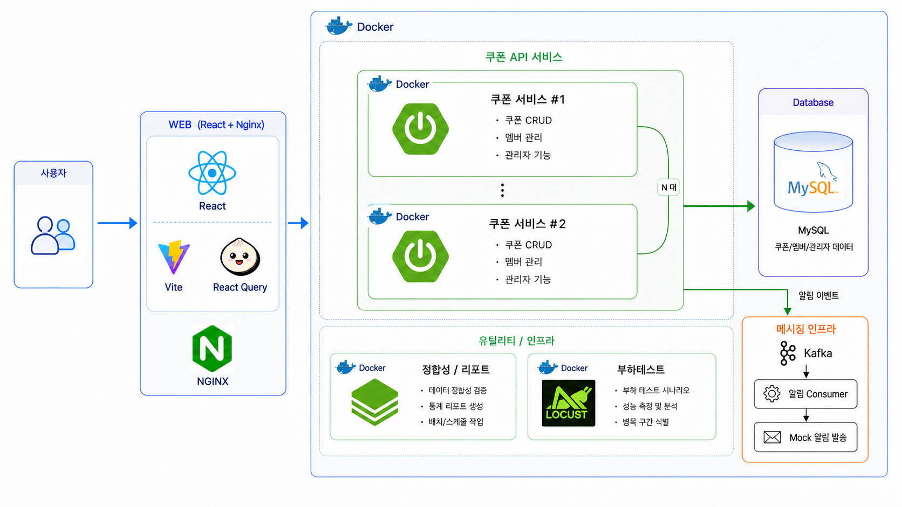

  
  <h1>쿠폰 야~호</h1>
  
🎟️ 통신사 브랜드데이 선착순 쿠폰 발급 시스템 🎟️

---

## ✍️ 프로젝트 개요

- **프로젝트명:** 쿠폰 야~호
- **프로젝트 기간:** 2026.08
- **프로젝트 형태:** 대규모 트래픽 처리 팀 프로젝트
- **목표:** 한순간에 몰리는 요청 속에서도 한정 수량 쿠폰을 정확하게 발급하고, 시스템 가용량에 맞춰 유입을 제어하는 쿠폰 플랫폼 개발
- **주요 사용자:** 브랜드데이 참여 고객, 쿠폰 운영 관리자

---

## ✍️ 프로젝트 소개

### 프로젝트 배경

브랜드데이 쿠폰 발급은 짧은 시간에 많은 요청이 집중되기 때문에 다음 문제를 함께 해결해야 합니다.

1. **재고 정합성** — 동시 요청에서도 초과 발급과 중복 발급 방지
2. **트래픽 보호** — 순간 유입으로 인한 애플리케이션과 데이터베이스 과부하 방지
3. **결과 검증** — 발급 결과와 저장 상태를 데이터와 지표로 교차 확인

**쿠폰 야~호**는 병목을 측정하고 구조를 단계적으로 발전시켰습니다. MySQL 동시성 제어에서 시작해 Redis 원자 재고 선점과 적응형 대기열을 구현했으며, Kafka 기반 비동기 영속화는 다음 단계의 설계안으로 정리했습니다.

---

## 🚀 프로젝트 목표

1. **정확한 발급** — 재고 초과 발급 방지, 회차별 1인 1매 보장
2. **안정적인 유입 제어** — 시스템 가용량에 맞춘 적응형 대기열 운영
3. **장애 회복** — Redis 선점 보상, 재구성, 멱등 재처리
4. **검증 가능한 운영** — 정합성 배치와 관측 지표를 통한 결과 추적

---

## 📌 주요 기능

### 사용자

- 브랜드데이·캘린더·공개 쿠폰 조회
- 선착순 쿠폰 발급 및 보유 쿠폰 조회
- 쿠폰 사용·사용 취소·발급 취소
- 대기열 입장, 순번·예상 대기시간 확인
- 입장 토큰 기반 쿠폰 서비스 접근

### 관리자

- 쿠폰 템플릿과 발급 회차 관리
- 회원별 발급 내역과 상태 이력 조회
- 쿠폰·재고·대기열·배치 운영 현황 확인
- 정합성 검증 실행 및 결과 조회
- 알림 실패 확인과 재전송 상태 관리

---

## 🔄 아키텍처 발전 과정

| 버전 | 상태 | 핵심 방식 | 해결한 문제 |
|:---:|:---:|---|---|
| **v1.1** | 구현 | MySQL 비관적 락 | 동시 발급 재고 정합성 확보 |
| **v1.2** | 구현 | 조건부 원자 `UPDATE` | 락 보유 구간과 DB 왕복 축소 |
| **v2.1** | 구현 | Redis Lua 원자 재고 선점 | DB 재고 행 경합 완화 |
| **v2.2** | 구현 | 적응형 대기열 | 가용량 기반 유입 제어 |
| **v3** | **설계** | Kafka 비동기 발급 이벤트 | 요청 처리와 DB 영속화 분리 설계 |

> **v3는 설계까지만 진행했으며, 발급 엔진 구현과 성능 검증 결과에는 포함하지 않습니다.**

### v1 — MySQL 중심 동기 발급

  

MySQL의 비관적 락과 조건부 원자 갱신으로 재고 정합성을 보장한 기준 구조입니다.

### v2 — Redis 선점과 적응형 대기열

  

Redis Lua로 재고를 원자적으로 선점하고, 대기열 서비스가 백엔드 가용량에 맞춰 입장량을 제어합니다.

### v3 — Kafka 비동기 영속화 설계

  

발급 요청 처리와 MySQL 영속화를 Kafka로 분리하고, 발급 결과를 묶어 저장하는 목표 구조입니다.

---

## 🧩 핵심 기술 설계

### 동시성 제어

- MySQL 비관적 락에서 조건부 원자 `UPDATE`로 락 구간 축소
- Redis Lua로 재고·회원 발급 여부·멱등 요청을 한 번에 판정
- DB 유일 제약으로 회차별 1인 1매 최종 보장

### 적응형 대기열

- 평시 요청 즉시 통과, 혼잡 시 대기열 전환
- 백엔드 가용량 기반 입장 허용량 계산
- 전역 순번·예상 대기시간·입장 토큰 제공
- 리더 선출, 이탈자 정리, 재진입 유예

### 멱등성과 실패 복구

- 동일 요청 재시도 시 저장된 결과 재사용
- DB 저장 실패 시 요청 토큰을 확인해 Redis 선점 보상
- Redis 상태 유실 시 DB 기준 재고 재구성

### 검증과 관측

- 발급 이력을 상태 머신으로 재생해 현재 상태와 재고 교차 검증
- CLEAN·CORRUPT 데이터셋 기반 검출 정확도 확인
- Prometheus 지표로 발급 결과·지연·재고·대기열·배치 상태 관측
- Locust로 동일 조건의 버전별 부하 테스트 수행

---

## ⚙️ 기술 스택

<table>
  <thead>
    <tr>
      <th>분류</th>
      <th>기술</th>
    </tr>
  </thead>
  <tbody>
    <tr>
      <td><b>Frontend</b></td>
      <td>React · Vite · React Query · NGINX</td>
    </tr>
    <tr>
      <td><b>Backend</b></td>
      <td>Java 21 · Spring Boot · Spring MVC · Spring WebFlux · Spring Batch</td>
    </tr>
    <tr>
      <td><b>Database</b></td>
      <td>MySQL · Flyway</td>
    </tr>
    <tr>
      <td><b>Cache / State</b></td>
      <td>Redis · Lua · Caffeine · Resilience4j</td>
    </tr>
    <tr>
      <td><b>Messaging</b></td>
      <td>Kafka</td>
    </tr>
    <tr>
      <td><b>Monitoring</b></td>
      <td>Actuator · Micrometer · Prometheus · Alertmanager</td>
    </tr>
    <tr>
      <td><b>Test</b></td>
      <td>JUnit 5 · AssertJ · Testcontainers · Locust</td>
    </tr>
    <tr>
      <td><b>Infrastructure</b></td>
      <td>Docker · Docker Compose · GitHub Actions</td>
    </tr>
  </tbody>
</table>

---

## 📂 저장소 안내

| 저장소 | 역할 |
|---|---|
| [`cy-fe`](https://github.com/coupon-yaho/cy-fe) | 프론트엔드 |
| [`cy-be`](https://github.com/coupon-yaho/cy-be) | 쿠폰 백엔드·배치 |
| [`cy-waiting`](https://github.com/coupon-yaho/cy-waiting) | 적응형 대기열 |
| [`cy-seed-data-generator`](https://github.com/coupon-yaho/cy-seed-data-generator) | 대용량 시드·검증 데이터 생성 |

---

## 🧑‍💻 팀원 소개

| 이름 | 담당 영역 | 주요 기여 |
|:---:|---|---|
| 허건 | 배치·검증·스키마 | 시드 생성기, 정합성 검증, DB 마이그레이션 |
| 유희준 | 대기열 게이트웨이 | 입장 판정, 전역 순번, 리더 선출 |
| 설승환 | 관측·인프라 | 관측 이벤트, Redis, 벤치마크 환경 |
| 이경주 | 관리자·관제 | 관리자 API, 관제 백엔드, 알림 계약 |
| 박지훈 | 쿠폰 도메인 | 쿠폰·회차, 발급 API, 재고 차감 |

---

  <b>정확한 발급 · 안정적인 유입 · 검증 가능한 운영</b>

